# RTM - Matriz de Rastreabilidade de Requisitos

## Requisitos Funcionais

| ID | Requisito Funcional | Tipo de teste | Arquivo(s) de teste | Status |
|---|---|---|---|---|
| RF-01 | Cadastrar usuário | E2E / Caixa Preta | `AuthE2ETest.java` (`RegistroTests`) | ✅ Implementado |
| RF-02 | Autenticar usuário (login) | E2E / Caixa Preta | `AuthE2ETest.java` (`LoginTests`) | ✅ Implementado |
| RF-03 | Cadastrar livro | E2E / Caixa Preta | `LivroE2ETest.java` (`CriarLivroTests`) | ✅ Implementado |
| RF-04 | Listar livros | E2E / Integração | `LivroE2ETest.java` (`ListarLivrosTests`) + `LivroServiceIntegrationTest.java` | ✅ Implementado |
| RF-05 | Buscar livro por ID | E2E / Integração | `LivroE2ETest.java` (`BuscarPorIdTests`) + `LivroServiceIntegrationTest.java` | ✅ Implementado |
| RF-06 | Atualizar livro | E2E / Integração | `LivroE2ETest.java` (`AtualizarLivroTests`) + `LivroServiceIntegrationTest.java` | ✅ Implementado |
| RF-07 | Excluir livro (soft delete — remove apenas da biblioteca do usuário) | E2E / Integração | `LivroE2ETest.java` (`RemoverLivroTests`) + `LivroServiceIntegrationTest.java` | ✅ Implementado |
| RF-08 | Gerenciar sessão (usuário autenticado) | E2E / Caixa Preta | `UsuarioE2ETest.java` (`MeTests`) — GET /me com token (200) e sem token (401) | ✅ Implementado |
| RF-09 | Consultar CEP via API externa (ViaCEP) | Integração / API Real + VCR + Parameterizado | `ViaCepIntegrationTest.java` — GET /api/cep/{cep} contra ViaCEP real; CEP válido (200); `@ParameterizedTest` cobre: inexistente (404), sem formatação (400), formato inválido (400) · `ViaCepServiceVcrTest.java` — VCR com cassetes gravados da API real (WireMock): CEP válido, inexistente, nulo, insuficiente | ✅ Implementado |
| RF-10 | Avaliar livro com estrelas e comentário | E2E / Caixa Preta | `AvaliacaoE2ETest.java` (`criarAvaliacao`) | ✅ Implementado |
| RF-11 | Visualizar avaliações de outros leitores | E2E / Caixa Preta | `AvaliacaoE2ETest.java` (`listarAvaliacoes`) | ✅ Implementado |
| RF-12 | Calcular média de avaliações por livro | E2E / Caixa Preta | `AvaliacaoE2ETest.java` (`mediasDeveRetornarLista`) | ✅ Implementado |
| RF-13 | Personalizar perfil (foto via Cloudinary, fonte, bio, privacidade, meta de leitura) | E2E / Caixa Preta | `UsuarioE2ETest.java` (`AtualizarTests`) — PUT /api/usuarios/me | ✅ Implementado |
| RF-14 | Visualizar perfil público de outro leitor | E2E / Caixa Preta | `UsuarioE2ETest.java` (`PerfilPublicoTests`) — perfil por nickname e por ID; perfil privado retorna 403 | ✅ Implementado |
| RF-15 | Adicionar perfil de leitor à lista de acompanhados | Frontend + Backend | `PerfilPage.jsx` + PUT /api/usuarios/me — `leitoresSeguidos` (lista de IDs) persistida no MongoDB; carregamento via GET /api/usuarios/perfil/id/{id} | ✅ Implementado |
| RF-16 | Adicionar livro de outro leitor à própria biblioteca | E2E / Caixa Preta | `LivroE2ETest.java` (`CriarLivroTests`) — POST /api/livros com status QUERO LER | ✅ Implementado |
| RF-17 | Curtir e responder comentários de avaliações | E2E / Caixa Preta | `AvaliacaoE2ETest.java` (`curtirEDescurtirAvaliacao`, `responderEExcluirResposta`) — toggle curtida e resposta com dois usuários distintos | ✅ Implementado |
| RF-18 | Navegar entre livros e ver recomendações em DetalhesLivroPage | Frontend | `DetalhesLivroPage.jsx` — setas prev/next; seção "Você também pode gostar" por autor ou categoria | ✅ Implementado |
| RF-19 | Visualizar próprios comentários e livros mais comentados no perfil | Frontend + Backend | `PerfilPage.jsx` + GET /api/avaliacoes/minhas — card de comentário exibe capa do livro e botão "Ver livro" para todos os comentários (livroId + livroCover armazenados na avaliação) | ✅ Implementado |
| RF-20 | Upload de imagens via armazenamento externo (Cloudinary) | E2E / Caixa Preta | `ImagemE2ETest.java` — POST /api/imagens/upload: foto de perfil (pasta=avatares) e plano de fundo (pasta=fundos); 401 sem token; 503 sem Cloudinary configurado | ✅ Implementado |
| RF-21 | Notificações de atividade para seguidores | E2E / Caixa Preta | `NotificacaoE2ETest.java` — GET /api/notificacoes (lista com notificação criada via avaliação), GET /api/notificacoes/contagem (naoLidas > 0), PUT /api/notificacoes/marcar-lidas (204 + contagem zera); 401 sem token em todos os endpoints | ✅ Implementado |
| RF-22 | Excluir livro permanentemente (criador — cascata em todos os leitores) | E2E / Caixa Preta | `LivroE2ETest.java` (`ExcluirPermanenteTests`) — criador exclui (204); outro usuário tenta excluir (403) | ✅ Implementado |
| RF-23 | Recomendar livros da comunidade que o usuário ainda não possui (`/livros/nao-tenho`) | E2E / Integração | `LivroE2ETest.java` (`NaoTenhoTests`, `DescobrirTests`) + `LivroServiceIntegrationTest.java` (`naoTenho_*`) | ✅ Implementado |
| RF-24 | Excluir notificação individual (`DELETE /api/notificacoes/{id}`) | E2E / Caixa Preta | `NotificacaoE2ETest.java` (`ExcluirNotificacaoTests`) — exclui notificação existente (204); lista fica menor após exclusão | ✅ Implementado |
| RF-25 | Restringir exclusão de livro ao criador + limpeza automática de avaliações órfãs | E2E / Caixa Preta + Integração | `LivroE2ETest.java` (`ExcluirPermanenteTests`) — 403 para não-criador; `LivroService.deletar` remove avaliações quando último exemplar é excluído | ✅ Implementado |

---

## Requisitos Não Funcionais

| ID | Eixo | Critério | Evidência | Status |
|---|---|---|---|---|
| RNF-01 | Segurança | Rotas protegidas com JWT + Spring Security | Testes E2E com e sem token | ✅ Implementado |
| RNF-02 | Testabilidade | Cobertura ≥ 80% (JaCoCo) | Check JaCoCo aprovado no CI — `img/Jacoco.png` | ✅ Implementado |
| RNF-03 | Qualidade | Análise estática com SonarCloud | Pipeline CI verde — Quality Gate aprovado | ✅ Configurado |
| RNF-04 | CI/CD | Pipeline GitHub Actions executando testes | GitHub Actions — https://github.com/AnaPaula2024/biblioteca/actions | ✅ Configurado |
| RNF-05 | Portabilidade | Banco em MongoDB Atlas (sem Docker para rodar o app) | README — passos detalhados | ✅ Implementado |
| RNF-06 | Escalabilidade | Arquitetura separada (Frontend React + Backend Spring Boot) | Estrutura do repositório | ✅ Implementado |

---

## Diagramas UML de Sequência

### RF-01 — Cadastrar Usuário


```mermaid
sequenceDiagram
    actor U as Usuário
    participant F as CadastroPage (React)
    participant A as AuthController
    participant S as UsuarioService
    participant V as UsuarioValidator
    participant R as UsuarioRepository
    participant M as MongoDB

    U->>F: Preenche nome, email e senha
    F->>A: POST /api/auth/register {nome, email, senha}
    A->>S: registrar(RegisterRequest)
    S->>V: validarRegistro(request)
    V-->>S: OK (ou lança exceção 400)
    S->>R: findByEmail(email)
    R->>M: query
    M-->>R: null
    R-->>S: Optional.empty()
    S->>R: save(usuario com senha criptografada BCrypt)
    R->>M: insert
    M-->>R: usuario salvo
    R-->>S: usuario
    S-->>A: AuthResponse{token}
    A-->>F: 200 OK + JWT token
    F->>F: localStorage.setItem("lybre_token", jwt)
    F->>U: Redireciona para /home
```

---

### RF-02 — Autenticar Usuário (Login)


```mermaid
sequenceDiagram
    actor U as Usuário
    participant F as LoginPage (React)
    participant A as AuthController
    participant S as UsuarioService
    participant R as UsuarioRepository
    participant J as JwtService
    participant M as MongoDB

    U->>F: Informa email e senha
    F->>A: POST /api/auth/login {email, senha}
    A->>S: autenticar(AuthRequest)
    S->>R: findByEmail(email)
    R->>M: query
    M-->>R: usuario
    R-->>S: Optional<Usuario>
    S->>S: verificar senha (BCrypt.matches)
    alt Senha correta
        S->>J: gerarToken(usuario)
        J-->>S: jwt
        S-->>A: AuthResponse{token}
        A-->>F: 200 OK + JWT token
        F->>F: localStorage.setItem("lybre_token", jwt)
        F->>U: Redireciona para /home
    else Senha incorreta
        S-->>A: lança AuthException
        A-->>F: 401 Unauthorized
        F->>U: Exibe mensagem de erro
    end
```

---

### RF-03 — Cadastrar Livro

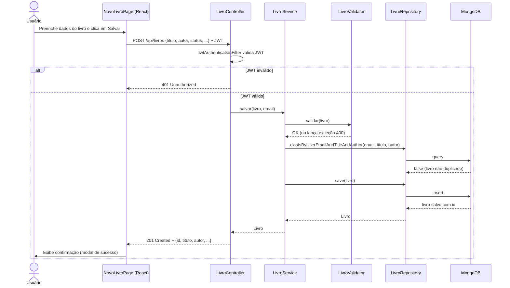
```mermaid
sequenceDiagram
    actor U as Usuário
    participant F as NovoLivroPage (React)
    participant L as LivroController
    participant S as LivroService
    participant V as LivroValidator
    participant R as LivroRepository
    participant M as MongoDB

    U->>F: Preenche dados do livro e clica em Salvar
    F->>L: POST /api/livros {titulo, autor, status, ...} + JWT
    L->>L: JwtAuthenticationFilter valida JWT
    alt JWT inválido
        L-->>F: 401 Unauthorized
    else JWT válido
        L->>S: salvar(livro, email)
        S->>V: validar(livro)
        V-->>S: OK (ou lança exceção 400)
        S->>R: existsByUserEmailAndTitleAndAuthor(email, titulo, autor)
        R->>M: query
        M-->>R: false (livro não duplicado)
        S->>R: save(livro)
        R->>M: insert
        M-->>R: livro salvo com id
        R-->>S: Livro
        S-->>L: Livro
        L-->>F: 201 Created + {id, titulo, autor, ...}
        F->>U: Exibe confirmação (modal de sucesso)
    end
```

---

### RF-04 — Listar Livros

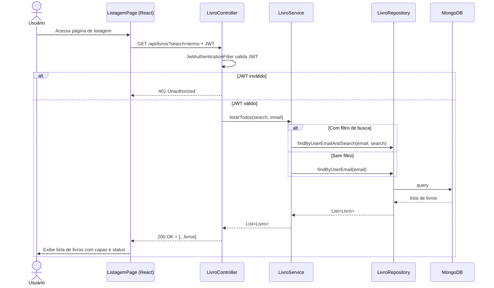
```mermaid
sequenceDiagram
    actor U as Usuário
    participant F as ListagemPage (React)
    participant L as LivroController
    participant S as LivroService
    participant R as LivroRepository
    participant M as MongoDB

    U->>F: Acessa página de listagem
    F->>L: GET /api/livros?search=termo + JWT
    L->>L: JwtAuthenticationFilter valida JWT
    alt JWT inválido
        L-->>F: 401 Unauthorized
    else JWT válido
        L->>S: listarTodos(search, email)
        alt Com filtro de busca
            S->>R: findByUserEmailAndSearch(email, search)
        else Sem filtro
            S->>R: findByUserEmail(email)
        end
        R->>M: query
        M-->>R: lista de livros
        R-->>S: List<Livro>
        S-->>L: List<Livro>
        L-->>F: 200 OK + [...livros]
        F->>U: Exibe lista de livros com capas e status
    end
```

---

### RF-05 — Buscar Livro por ID

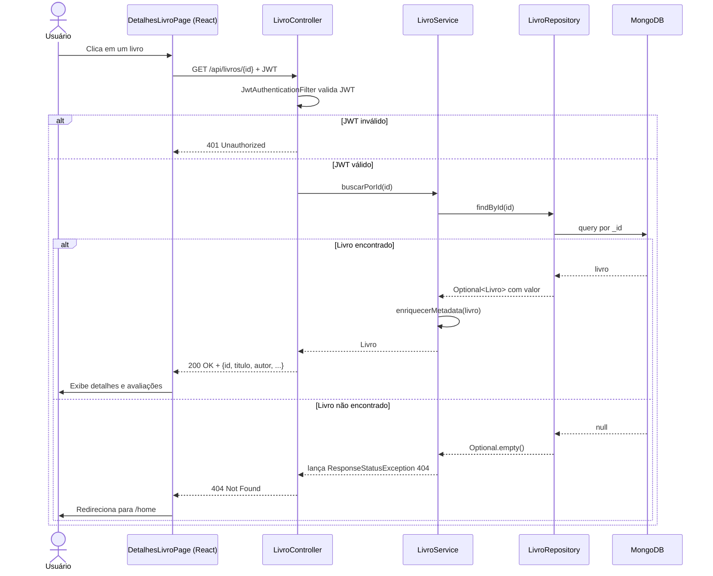
```mermaid
sequenceDiagram
    actor U as Usuário
    participant F as DetalhesLivroPage (React)
    participant L as LivroController
    participant S as LivroService
    participant R as LivroRepository
    participant M as MongoDB

    U->>F: Clica em um livro
    F->>L: GET /api/livros/{id} + JWT
    L->>L: JwtAuthenticationFilter valida JWT
    alt JWT inválido
        L-->>F: 401 Unauthorized
    else JWT válido
        L->>S: buscarPorId(id)
        S->>R: findById(id)
        R->>M: query por _id
        alt Livro encontrado
            M-->>R: livro
            R-->>S: Optional<Livro> com valor
            S->>S: enriquecerMetadata(livro)
            S-->>L: Livro
            L-->>F: 200 OK + {id, titulo, autor, ...}
            F->>U: Exibe detalhes e avaliações
        else Livro não encontrado
            M-->>R: null
            R-->>S: Optional.empty()
            S-->>L: lança ResponseStatusException 404
            L-->>F: 404 Not Found
            F->>U: Redireciona para /home
        end
    end
```

---

### RF-06 — Atualizar Livro

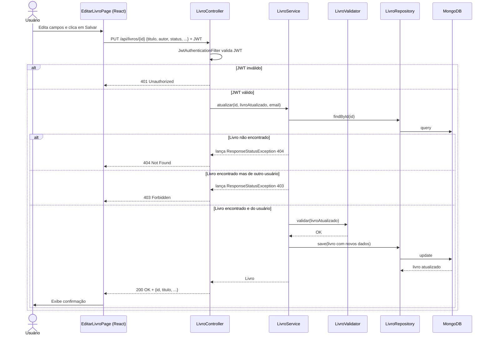
```mermaid
sequenceDiagram
    actor U as Usuário
    participant F as EditarLivroPage (React)
    participant L as LivroController
    participant S as LivroService
    participant V as LivroValidator
    participant R as LivroRepository
    participant M as MongoDB

    U->>F: Edita campos e clica em Salvar
    F->>L: PUT /api/livros/{id} {titulo, autor, status, ...} + JWT
    L->>L: JwtAuthenticationFilter valida JWT
    alt JWT inválido
        L-->>F: 401 Unauthorized
    else JWT válido
        L->>S: atualizar(id, livroAtualizado, email)
        S->>R: findById(id)
        R->>M: query
        alt Livro não encontrado
            S-->>L: lança ResponseStatusException 404
            L-->>F: 404 Not Found
        else Livro encontrado mas de outro usuário
            S-->>L: lança ResponseStatusException 403
            L-->>F: 403 Forbidden
        else Livro encontrado e do usuário
            S->>V: validar(livroAtualizado)
            V-->>S: OK
            S->>R: save(livro com novos dados)
            R->>M: update
            M-->>R: livro atualizado
            S-->>L: Livro
            L-->>F: 200 OK + {id, titulo, ...}
            F->>U: Exibe confirmação
        end
    end
```

---

### RF-07 — Excluir Livro

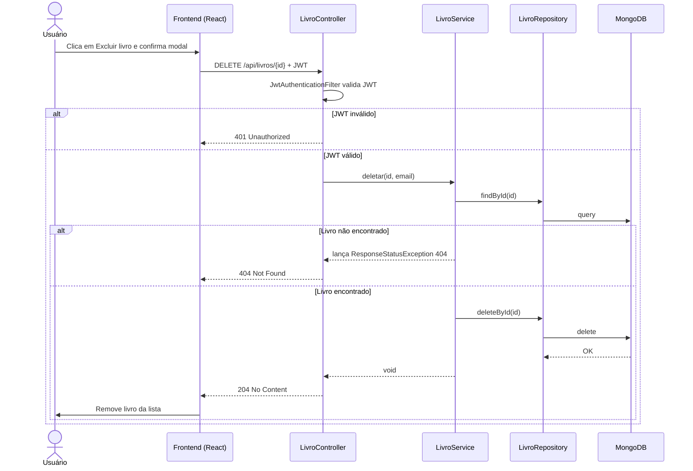
```mermaid
sequenceDiagram
    actor U as Usuário
    participant F as Frontend (React)
    participant L as LivroController
    participant S as LivroService
    participant R as LivroRepository
    participant M as MongoDB

    U->>F: Clica em Excluir livro e confirma modal
    F->>L: DELETE /api/livros/{id} + JWT
    L->>L: JwtAuthenticationFilter valida JWT
    alt JWT inválido
        L-->>F: 401 Unauthorized
    else JWT válido
        L->>S: deletar(id, email)
        S->>R: findById(id)
        R->>M: query
        alt Livro não encontrado
            S-->>L: lança ResponseStatusException 404
            L-->>F: 404 Not Found
        else Livro encontrado
            S->>R: deleteById(id)
            R->>M: delete
            M-->>R: OK
            S-->>L: void
            L-->>F: 204 No Content
            F->>U: Remove livro da lista
        end
    end
```

---

### RF-08 — Gerenciar Sessão (Usuário Autenticado)

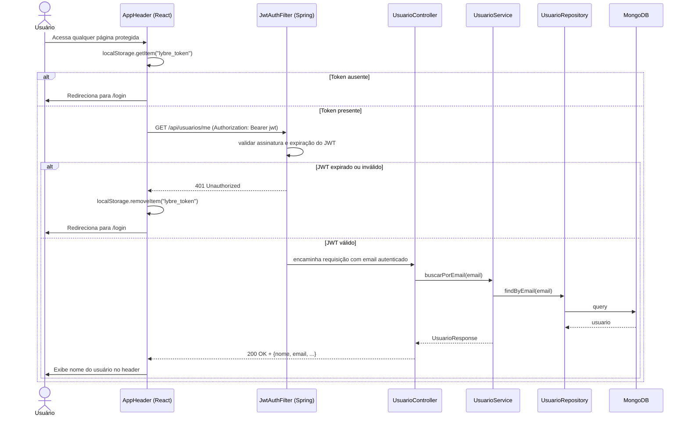
```mermaid
sequenceDiagram
    actor U as Usuário
    participant F as AppHeader (React)
    participant J as JwtAuthFilter (Spring)
    participant C as UsuarioController
    participant S as UsuarioService
    participant R as UsuarioRepository
    participant M as MongoDB

    U->>F: Acessa qualquer página protegida
    F->>F: localStorage.getItem("lybre_token")
    alt Token ausente
        F->>U: Redireciona para /login
    else Token presente
        F->>J: GET /api/usuarios/me (Authorization: Bearer jwt)
        J->>J: validar assinatura e expiração do JWT
        alt JWT expirado ou inválido
            J-->>F: 401 Unauthorized
            F->>F: localStorage.removeItem("lybre_token")
            F->>U: Redireciona para /login
        else JWT válido
            J->>C: encaminha requisição com email autenticado
            C->>S: buscarPorEmail(email)
            S->>R: findByEmail(email)
            R->>M: query
            M-->>R: usuario
            S-->>C: UsuarioResponse
            C-->>F: 200 OK + {nome, email, ...}
            F->>U: Exibe nome do usuário no header
        end
    end
```

---

### RF-09 — Consultar CEP via API Externa (ViaCEP)

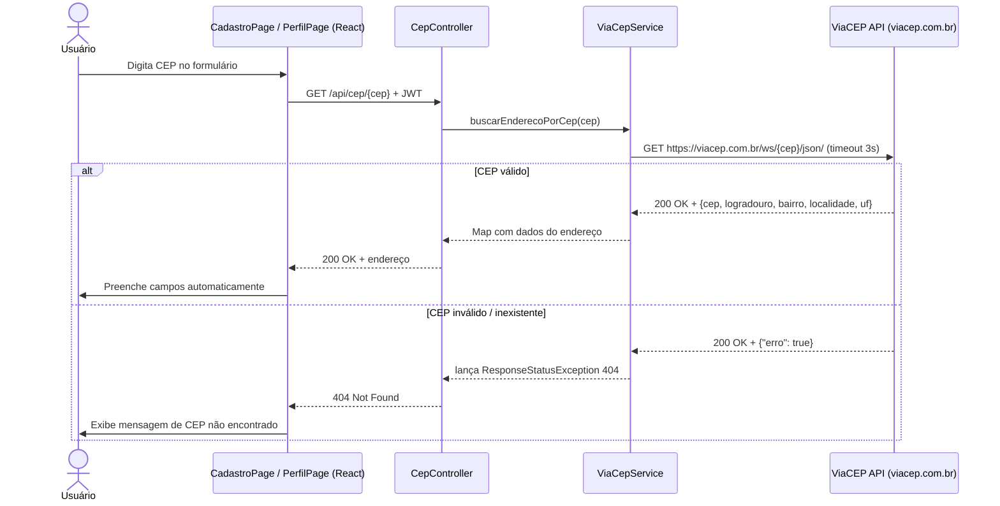
```mermaid
sequenceDiagram
    actor U as Usuário
    participant F as CadastroPage / PerfilPage (React)
    participant C as CepController
    participant S as ViaCepService
    participant V as ViaCEP API (viacep.com.br)

    U->>F: Digita CEP no formulário
    F->>C: GET /api/cep/{cep} + JWT
    C->>S: buscarEnderecoPorCep(cep)
    S->>V: GET https://viacep.com.br/ws/{cep}/json/ (timeout 3s)
    alt CEP válido
        V-->>S: 200 OK + {cep, logradouro, bairro, localidade, uf}
        S-->>C: Map com dados do endereço
        C-->>F: 200 OK + endereço
        F->>U: Preenche campos automaticamente
    else CEP inválido / inexistente
        V-->>S: 200 OK + {"erro": true}
        S-->>C: lança ResponseStatusException 404
        C-->>F: 404 Not Found
        F->>U: Exibe mensagem de CEP não encontrado
    end
```

---

### RF-10 — Avaliar Livro com Estrelas e Comentário

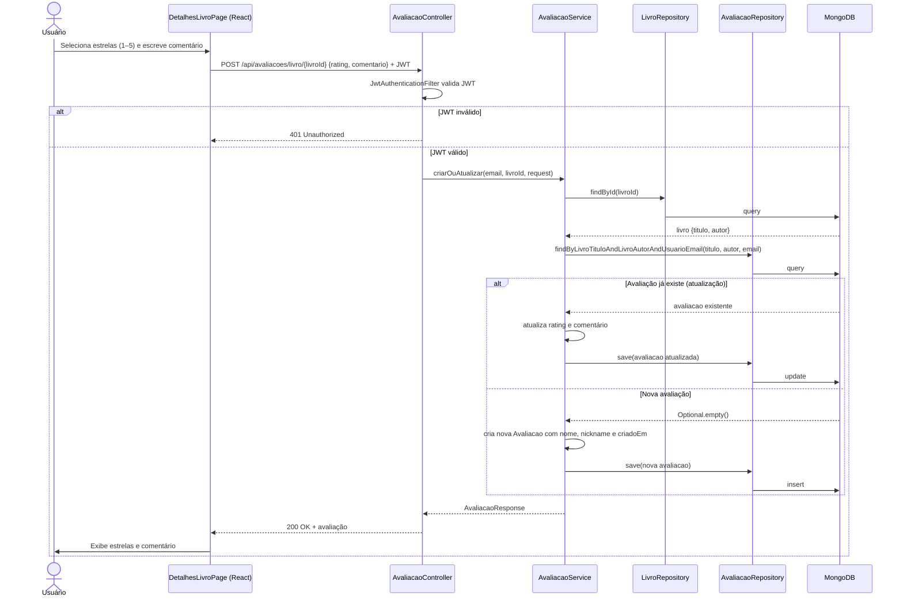
```mermaid
sequenceDiagram
    actor U as Usuário
    participant F as DetalhesLivroPage (React)
    participant C as AvaliacaoController
    participant S as AvaliacaoService
    participant LR as LivroRepository
    participant AR as AvaliacaoRepository
    participant M as MongoDB

    U->>F: Seleciona estrelas (1–5) e escreve comentário
    F->>C: POST /api/avaliacoes/livro/{livroId} {rating, comentario} + JWT
    C->>C: JwtAuthenticationFilter valida JWT
    alt JWT inválido
        C-->>F: 401 Unauthorized
    else JWT válido
        C->>S: criarOuAtualizar(email, livroId, request)
        S->>LR: findById(livroId)
        LR->>M: query
        M-->>S: livro {titulo, autor}
        S->>AR: findByLivroTituloAndLivroAutorAndUsuarioEmail(titulo, autor, email)
        AR->>M: query
        alt Avaliação já existe (atualização)
            M-->>S: avaliacao existente
            S->>S: atualiza rating e comentário
            S->>AR: save(avaliacao atualizada)
            AR->>M: update
        else Nova avaliação
            M-->>S: Optional.empty()
            S->>S: cria nova Avaliacao com nome, nickname e criadoEm
            S->>AR: save(nova avaliacao)
            AR->>M: insert
        end
        S-->>C: AvaliacaoResponse
        C-->>F: 200 OK + avaliação
        F->>U: Exibe estrelas e comentário
    end
```

---

### RF-11 — Visualizar Avaliações de Outros Leitores

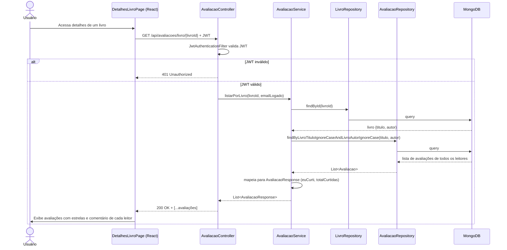
```mermaid
sequenceDiagram
    actor U as Usuário
    participant F as DetalhesLivroPage (React)
    participant C as AvaliacaoController
    participant S as AvaliacaoService
    participant LR as LivroRepository
    participant AR as AvaliacaoRepository
    participant M as MongoDB

    U->>F: Acessa detalhes de um livro
    F->>C: GET /api/avaliacoes/livro/{livroId} + JWT
    C->>C: JwtAuthenticationFilter valida JWT
    alt JWT inválido
        C-->>F: 401 Unauthorized
    else JWT válido
        C->>S: listarPorLivro(livroId, emailLogado)
        S->>LR: findById(livroId)
        LR->>M: query
        M-->>S: livro {titulo, autor}
        S->>AR: findByLivroTituloIgnoreCaseAndLivroAutorIgnoreCase(titulo, autor)
        AR->>M: query
        M-->>AR: lista de avaliações de todos os leitores
        AR-->>S: List<Avaliacao>
        S->>S: mapeia para AvaliacaoResponse (euCurti, totalCurtidas)
        S-->>C: List<AvaliacaoResponse>
        C-->>F: 200 OK + [...avaliações]
        F->>U: Exibe avaliações com estrelas e comentário de cada leitor
    end
```

---

### RF-12 — Calcular Média de Avaliações por Livro

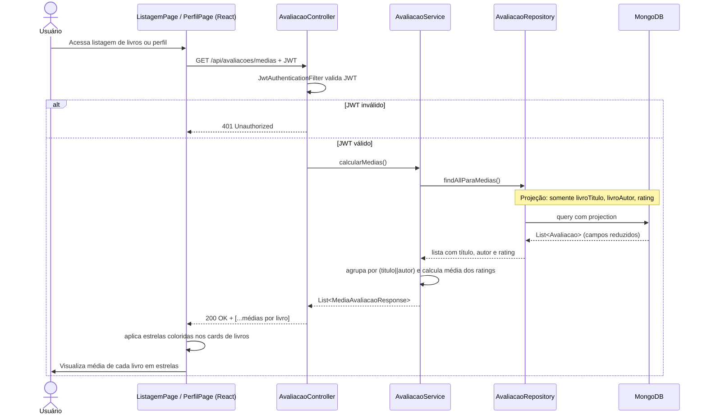
```mermaid
sequenceDiagram
    actor U as Usuário
    participant F as ListagemPage / PerfilPage (React)
    participant C as AvaliacaoController
    participant S as AvaliacaoService
    participant R as AvaliacaoRepository
    participant M as MongoDB

    U->>F: Acessa listagem de livros ou perfil
    F->>C: GET /api/avaliacoes/medias + JWT
    C->>C: JwtAuthenticationFilter valida JWT
    alt JWT inválido
        C-->>F: 401 Unauthorized
    else JWT válido
        C->>S: calcularMedias()
        S->>R: findAllParaMedias()
        Note over R,M: Projeção: somente livroTitulo, livroAutor, rating
        R->>M: query com projection
        M-->>R: List<Avaliacao> (campos reduzidos)
        R-->>S: lista com título, autor e rating
        S->>S: agrupa por (titulo||autor) e calcula média dos ratings
        S-->>C: List<MediaAvaliacaoResponse>
        C-->>F: 200 OK + [...médias por livro]
        F->>F: aplica estrelas coloridas nos cards de livros
        F->>U: Visualiza média de cada livro em estrelas
    end
```

---

### RF-13 — Personalizar Perfil

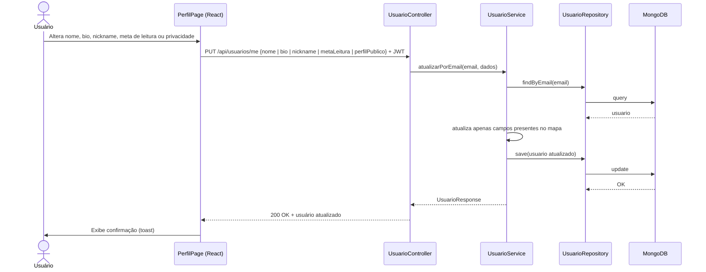
```mermaid
sequenceDiagram
    actor U as Usuário
    participant F as PerfilPage (React)
    participant C as UsuarioController
    participant S as UsuarioService
    participant R as UsuarioRepository
    participant M as MongoDB

    U->>F: Altera nome, bio, nickname, meta de leitura ou privacidade
    F->>C: PUT /api/usuarios/me {nome | bio | nickname | metaLeitura | perfilPublico} + JWT
    C->>S: atualizarPorEmail(email, dados)
    S->>R: findByEmail(email)
    R->>M: query
    M-->>R: usuario
    S->>S: atualiza apenas campos presentes no mapa
    S->>R: save(usuario atualizado)
    R->>M: update
    M-->>R: OK
    S-->>C: UsuarioResponse
    C-->>F: 200 OK + usuário atualizado
    F->>U: Exibe confirmação (toast)
```

---

### RF-14 — Visualizar Perfil Público

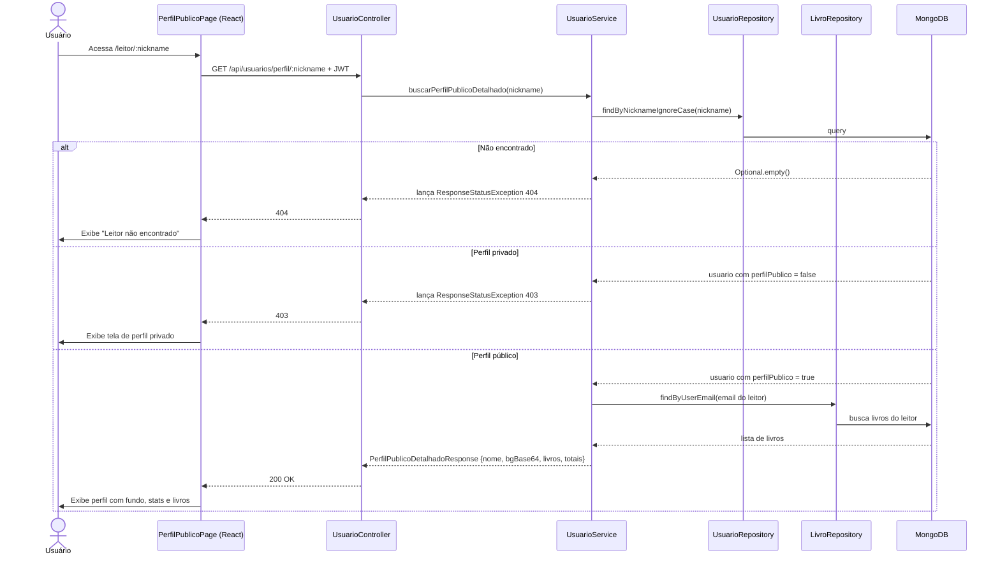
```mermaid
sequenceDiagram
    actor U as Usuário
    participant F as PerfilPublicoPage (React)
    participant C as UsuarioController
    participant S as UsuarioService
    participant UR as UsuarioRepository
    participant LR as LivroRepository
    participant M as MongoDB

    U->>F: Acessa /leitor/:nickname
    F->>C: GET /api/usuarios/perfil/:nickname + JWT
    C->>S: buscarPerfilPublicoDetalhado(nickname)
    S->>UR: findByNicknameIgnoreCase(nickname)
    UR->>M: query
    alt Não encontrado
        M-->>S: Optional.empty()
        S-->>C: lança ResponseStatusException 404
        C-->>F: 404
        F->>U: Exibe "Leitor não encontrado"
    else Perfil privado
        M-->>S: usuario com perfilPublico = false
        S-->>C: lança ResponseStatusException 403
        C-->>F: 403
        F->>U: Exibe tela de perfil privado
    else Perfil público
        M-->>S: usuario com perfilPublico = true
        S->>LR: findByUserEmail(email do leitor)
        LR->>M: busca livros do leitor
        M-->>S: lista de livros
        S-->>C: PerfilPublicoDetalhadoResponse {nome, bgBase64, livros, totais}
        C-->>F: 200 OK
        F->>U: Exibe perfil com fundo, stats e livros
    end
```

---

### RF-15 — Adicionar Perfil de Leitor

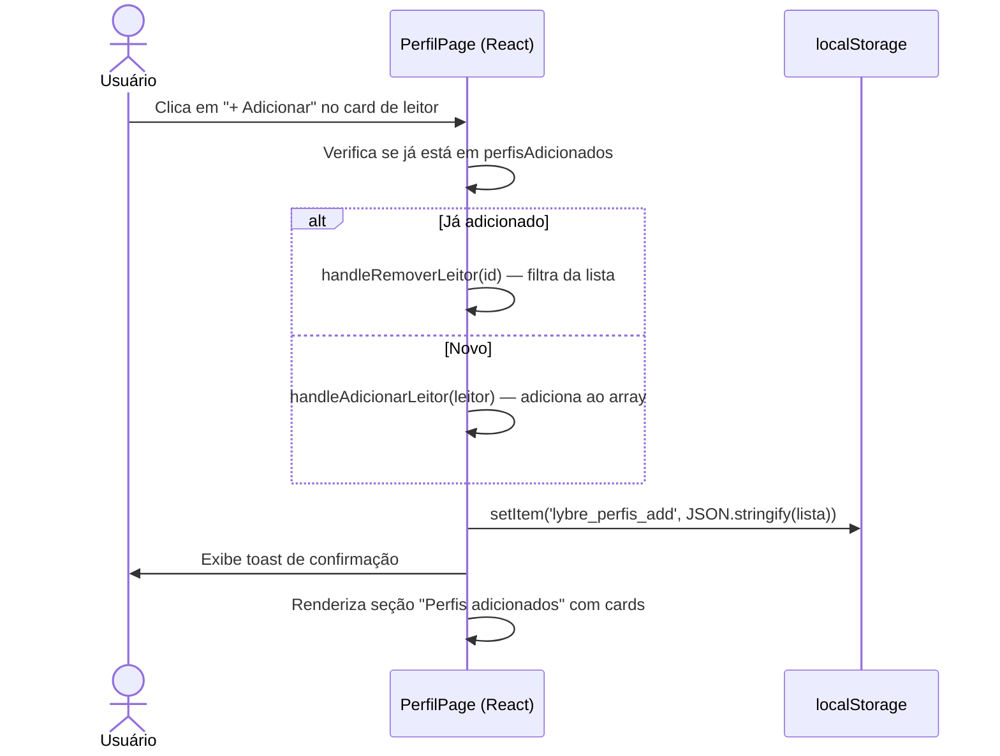
```mermaid
sequenceDiagram
    actor U as Usuário
    participant F as PerfilPage (React)
    participant LS as localStorage

    U->>F: Clica em "+ Adicionar" no card de leitor
    F->>F: Verifica se já está em perfisAdicionados
    alt Já adicionado
        F->>F: handleRemoverLeitor(id) — filtra da lista
    else Novo
        F->>F: handleAdicionarLeitor(leitor) — adiciona ao array
    end
    F->>LS: setItem('lybre_perfis_add', JSON.stringify(lista))
    F->>U: Exibe toast de confirmação
    F->>F: Renderiza seção "Perfis adicionados" com cards
```

---

### RF-16 — Adicionar Livro de Outro Leitor

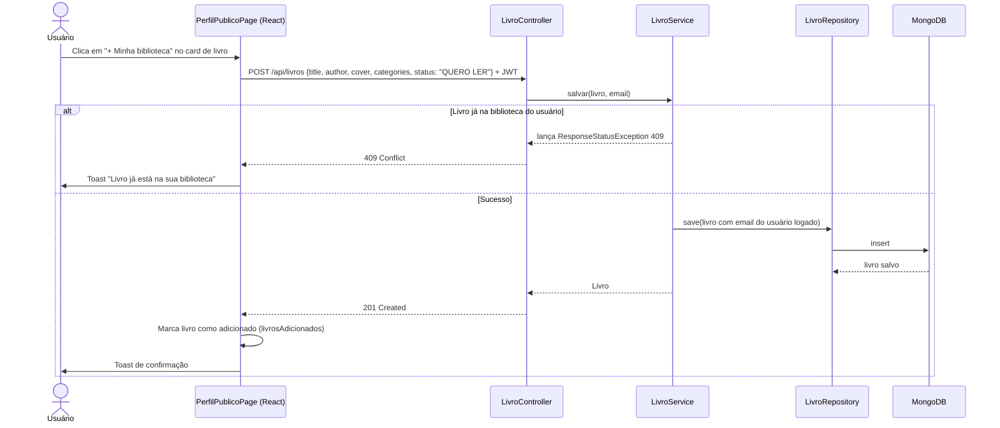
```mermaid
sequenceDiagram
    actor U as Usuário
    participant F as PerfilPublicoPage (React)
    participant C as LivroController
    participant S as LivroService
    participant R as LivroRepository
    participant M as MongoDB

    U->>F: Clica em "+ Minha biblioteca" no card de livro
    F->>C: POST /api/livros {title, author, cover, categories, status: "QUERO LER"} + JWT
    C->>S: salvar(livro, email)
    alt Livro já na biblioteca do usuário
        S-->>C: lança ResponseStatusException 409
        C-->>F: 409 Conflict
        F->>U: Toast "Livro já está na sua biblioteca"
    else Sucesso
        S->>R: save(livro com email do usuário logado)
        R->>M: insert
        M-->>R: livro salvo
        S-->>C: Livro
        C-->>F: 201 Created
        F->>F: Marca livro como adicionado (livrosAdicionados)
        F->>U: Toast de confirmação
    end
```

---

### RF-17 — Curtir e Responder Comentários

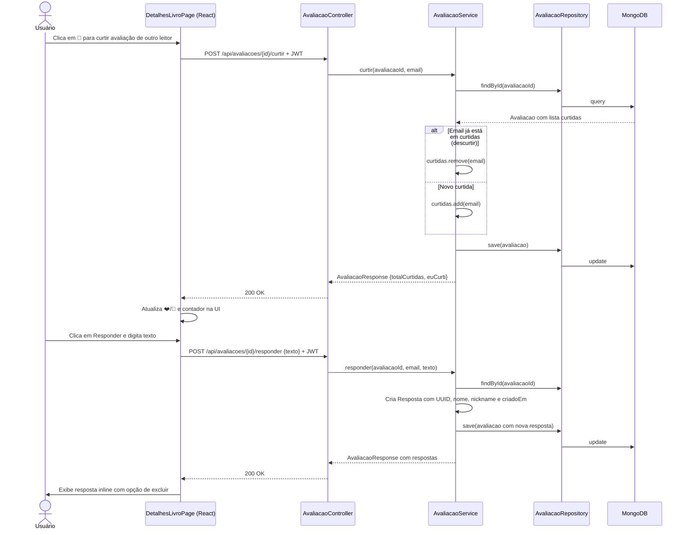
```mermaid
sequenceDiagram
    actor U as Usuário
    participant F as DetalhesLivroPage (React)
    participant C as AvaliacaoController
    participant S as AvaliacaoService
    participant R as AvaliacaoRepository
    participant M as MongoDB

    U->>F: Clica em 🤍 para curtir avaliação de outro leitor
    F->>C: POST /api/avaliacoes/{id}/curtir + JWT
    C->>S: curtir(avaliacaoId, email)
    S->>R: findById(avaliacaoId)
    R->>M: query
    M-->>S: Avaliacao com lista curtidas
    alt Email já está em curtidas (descurtir)
        S->>S: curtidas.remove(email)
    else Novo curtida
        S->>S: curtidas.add(email)
    end
    S->>R: save(avaliacao)
    R->>M: update
    S-->>C: AvaliacaoResponse {totalCurtidas, euCurti}
    C-->>F: 200 OK
    F->>F: Atualiza ❤️/🤍 e contador na UI

    U->>F: Clica em Responder e digita texto
    F->>C: POST /api/avaliacoes/{id}/responder {texto} + JWT
    C->>S: responder(avaliacaoId, email, texto)
    S->>R: findById(avaliacaoId)
    S->>S: Cria Resposta com UUID, nome, nickname e criadoEm
    S->>R: save(avaliacao com nova resposta)
    R->>M: update
    S-->>C: AvaliacaoResponse com respostas
    C-->>F: 200 OK
    F->>U: Exibe resposta inline com opção de excluir
```

---

### RF-18 — Navegar entre Livros e Ver Recomendações

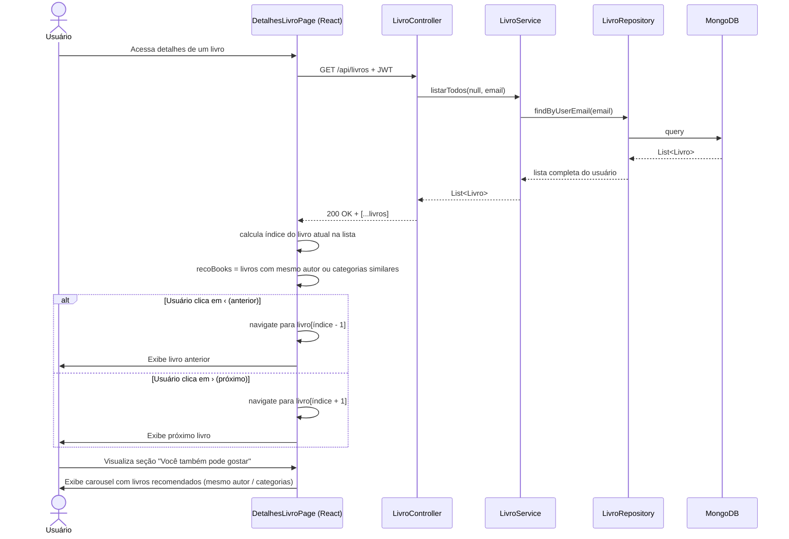
```mermaid
sequenceDiagram
    actor U as Usuário
    participant F as DetalhesLivroPage (React)
    participant L as LivroController
    participant S as LivroService
    participant R as LivroRepository
    participant M as MongoDB

    U->>F: Acessa detalhes de um livro
    F->>L: GET /api/livros + JWT
    L->>S: listarTodos(null, email)
    S->>R: findByUserEmail(email)
    R->>M: query
    M-->>R: List<Livro>
    R-->>S: lista completa do usuário
    S-->>L: List<Livro>
    L-->>F: 200 OK + [...livros]
    F->>F: calcula índice do livro atual na lista
    F->>F: recoBooks = livros com mesmo autor ou categorias similares

    alt Usuário clica em ‹ (anterior)
        F->>F: navigate para livro[índice - 1]
        F->>U: Exibe livro anterior
    else Usuário clica em › (próximo)
        F->>F: navigate para livro[índice + 1]
        F->>U: Exibe próximo livro
    end

    U->>F: Visualiza seção "Você também pode gostar"
    F->>U: Exibe carousel com livros recomendados (mesmo autor / categorias)
```

---

### RF-19 — Comentários e Livros Mais Comentados no Perfil

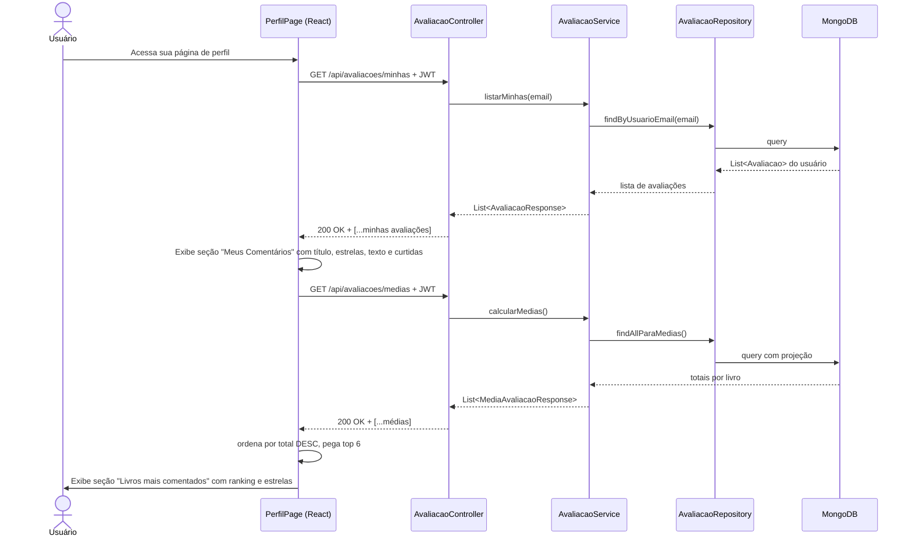
```mermaid
sequenceDiagram
    actor U as Usuário
    participant F as PerfilPage (React)
    participant AC as AvaliacaoController
    participant AS as AvaliacaoService
    participant AR as AvaliacaoRepository
    participant M as MongoDB

    U->>F: Acessa sua página de perfil
    F->>AC: GET /api/avaliacoes/minhas + JWT
    AC->>AS: listarMinhas(email)
    AS->>AR: findByUsuarioEmail(email)
    AR->>M: query
    M-->>AR: List<Avaliacao> do usuário
    AR-->>AS: lista de avaliações
    AS-->>AC: List<AvaliacaoResponse>
    AC-->>F: 200 OK + [...minhas avaliações]
    F->>F: Exibe seção "Meus Comentários" com título, estrelas, texto e curtidas

    F->>AC: GET /api/avaliacoes/medias + JWT
    AC->>AS: calcularMedias()
    AS->>AR: findAllParaMedias()
    AR->>M: query com projeção
    M-->>AS: totais por livro
    AS-->>AC: List<MediaAvaliacaoResponse>
    AC-->>F: 200 OK + [...médias]
    F->>F: ordena por total DESC, pega top 6
    F->>U: Exibe seção "Livros mais comentados" com ranking e estrelas
```

---

### RF-20 — Upload de Foto de Perfil via Cloudinary

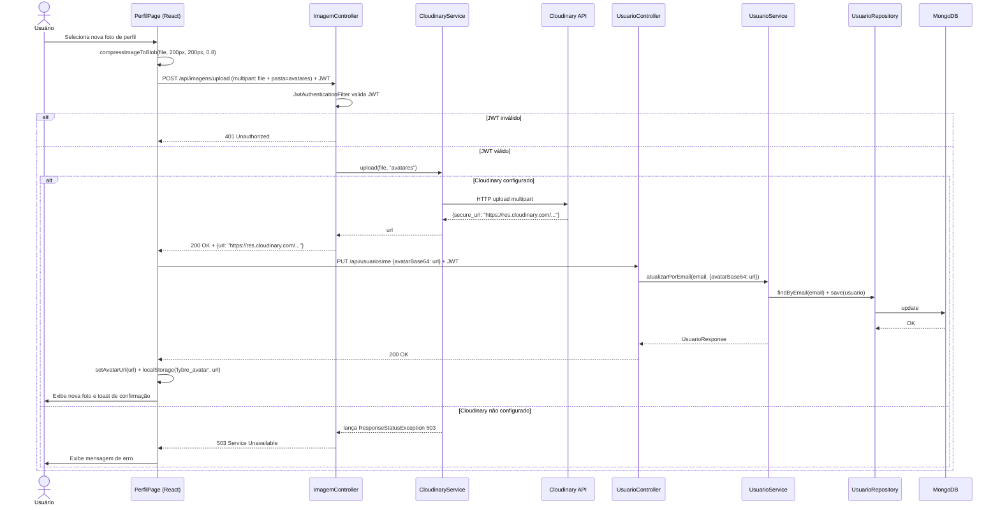
```mermaid
sequenceDiagram
    actor U as Usuário
    participant F as PerfilPage (React)
    participant I as ImagemController
    participant CS as CloudinaryService
    participant CL as Cloudinary API
    participant UC as UsuarioController
    participant US as UsuarioService
    participant R as UsuarioRepository
    participant M as MongoDB

    U->>F: Seleciona nova foto de perfil
    F->>F: compressImageToBlob(file, 200px, 200px, 0.8)
    F->>I: POST /api/imagens/upload (multipart: file + pasta=avatares) + JWT
    I->>I: JwtAuthenticationFilter valida JWT
    alt JWT inválido
        I-->>F: 401 Unauthorized
    else JWT válido
        I->>CS: upload(file, "avatares")
        alt Cloudinary configurado
            CS->>CL: HTTP upload multipart
            CL-->>CS: {secure_url: "https://res.cloudinary.com/..."}
            CS-->>I: url
            I-->>F: 200 OK + {url: "https://res.cloudinary.com/..."}
            F->>UC: PUT /api/usuarios/me {avatarBase64: url} + JWT
            UC->>US: atualizarPorEmail(email, {avatarBase64: url})
            US->>R: findByEmail(email) + save(usuario)
            R->>M: update
            M-->>R: OK
            US-->>UC: UsuarioResponse
            UC-->>F: 200 OK
            F->>F: setAvatarUrl(url) + localStorage('lybre_avatar', url)
            F->>U: Exibe nova foto e toast de confirmação
        else Cloudinary não configurado
            CS-->>I: lança ResponseStatusException 503
            I-->>F: 503 Service Unavailable
            F->>U: Exibe mensagem de erro
        end
    end
```

---

### RF-21 — Notificações de Atividade para Seguidores

```mermaid
sequenceDiagram
    actor A as Leitor Ator
    actor S as Seguidor
    participant F as Frontend (React)
    participant AC as AvaliacaoController
    participant AS as AvaliacaoService
    participant NS as NotificacaoService
    participant UR as UsuarioRepository
    participant NR as NotificacaoRepository
    participant M as MongoDB

    A->>F: Avalia um livro (POST /api/avaliacoes/livro/{id})
    F->>AC: POST /api/avaliacoes/livro/{livroId} {rating, comentario} + JWT
    AC->>AS: criarOuAtualizar(emailAtor, livroId, request)
    AS->>AS: salva avaliação
    AS->>NS: notificarSeguidores(emailAtor, "AVALIACAO_CRIADA", titulo, autor, null)
    NS->>UR: findByEmail(emailAtor)
    UR->>M: query
    M-->>NS: ator {id, nome, nickname}
    NS->>UR: findByLeitoresSeguidosContaining(atorId)
    UR->>M: query
    M-->>NS: List<Usuario> seguidores
    loop Para cada seguidor
        NS->>NR: save(Notificacao{usuarioEmail=seguidor, tipo, livroTitulo, remetente, lida=false})
        NR->>M: insert
    end
    AS-->>AC: AvaliacaoResponse
    AC-->>F: 200 OK

    S->>F: Acessa sino de notificações
    F->>AC: GET /api/notificacoes/contagem + JWT (seguidor)
    AC-->>F: 200 OK + {naoLidas: 1}
    F->>F: Exibe badge vermelho no sino

    S->>F: Abre lista de notificações
    F->>AC: GET /api/notificacoes + JWT (seguidor)
    AC-->>F: 200 OK + [notificação com tipo e livroTitulo]
    F->>S: Exibe notificação "X avaliou Y"

    S->>F: Clica em "Marcar todas como lidas"
    F->>AC: PUT /api/notificacoes/marcar-lidas + JWT
    AC-->>F: 204 No Content
    F->>S: Badge some (contagem = 0)
```

---

### RF-22 — Exclusão Permanente de Livro (Criador)

```mermaid
sequenceDiagram
    actor C as Criador do Livro
    actor L as Outro Leitor
    participant F as Frontend (React)
    participant LC as LivroController
    participant LS as LivroService
    participant LR as LivroRepository
    participant AR as AvaliacaoRepository
    participant NS as NotificacaoService
    participant M as MongoDB

    C->>F: Clica em "Excluir de todos" e confirma modal
    F->>LC: DELETE /api/livros/{id}/permanente + JWT (criador)
    LC->>LS: deletarPermanente(id, emailCriador)
    LS->>LR: findById(id)
    LR->>M: query
    M-->>LS: livro {titulo, autor, criadorEmail}
    alt Não é o criador
        LS-->>LC: lança ResponseStatusException 403
        LC-->>F: 403 Forbidden
        F->>C: Exibe mensagem de erro
    else É o criador
        LS->>LR: findAllByTitleIgnoreCaseAndAuthorIgnoreCase(titulo, autor)
        LR->>M: query — todas as cópias
        M-->>LS: List<Livro> de todos os leitores
        loop Para cada cópia
            LS->>AR: findByLivroTituloAndLivroAutorAndUsuarioEmail(...) + ifPresent(delete)
            AR->>M: delete avaliação
            LS->>NS: notificarUsuario(emailCopia, "LIVRO_EXCLUIDO_PERMANENTE", ...)
            NS->>M: insert notificação
            LS->>LR: deleteById(copia.id)
            LR->>M: delete
        end
        LS-->>LC: void
        LC-->>F: 204 No Content
        F->>C: Remove livro da tela e exibe confirmação
        F->>L: Próximo acesso: livro não existe mais na biblioteca
    end
```

---

### RF-23 — Recomendar Livros da Comunidade que o Usuário Não Possui

```mermaid
sequenceDiagram
    actor U as Usuário
    participant F as DescobrirPage (React)
    participant LC as LivroController
    participant LS as LivroService
    participant LR as LivroRepository
    participant M as MongoDB

    U->>F: Acessa aba "Não tenho" / "Descobrir"
    F->>LC: GET /api/livros/nao-tenho + JWT
    LC->>LC: JwtAuthenticationFilter valida JWT
    alt JWT inválido
        LC-->>F: 401 Unauthorized
    else JWT válido
        LC->>LS: naoTenho(email)
        LS->>LR: findByUserEmail(email)
        LR->>M: query — livros do próprio usuário
        M-->>LR: List<Livro> do usuário
        LR-->>LS: List<Livro>
        LS->>LS: Extrai chaves titulo+autor dos livros do usuário (Set<String> meus)
        LS->>LR: findTodosDaComunidade(email)
        LR->>M: query — livros de outros leitores
        M-->>LR: List<Livro> da comunidade
        LR-->>LS: List<Livro>
        LS->>LS: Filtra: apenas livros com capa, exclui os que o usuário já tem, remove duplicatas
        LS-->>LC: List<Livro> recomendados
        LC-->>F: 200 OK + [livros da comunidade que o usuário não possui]
        F->>U: Exibe cards de livros recomendados com capa e título
    end
```

---

### RF-24 — Excluir Notificação Individual

```mermaid
sequenceDiagram
    actor U as Usuário
    participant F as NotificacoesPage (React)
    participant NC as NotificacaoController
    participant NS as NotificacaoService
    participant NR as NotificacaoRepository
    participant M as MongoDB

    U->>F: Clica no ícone de excluir em uma notificação
    F->>NC: DELETE /api/notificacoes/{id} + JWT
    NC->>NC: JwtAuthenticationFilter valida JWT
    alt JWT inválido
        NC-->>F: 401 Unauthorized
    else JWT válido
        NC->>NS: excluir(id, email)
        NS->>NR: findById(id)
        NR->>M: query
        M-->>NR: Optional<Notificacao>
        alt Notificação não encontrada
            NS-->>NC: (sem ação — ifPresent não executa)
        else Notificação encontrada
            NS->>NS: Verifica se usuarioEmail == email autenticado
            alt E-mail não corresponde (não é dono)
                NS-->>NC: (sem ação — guarda segurança)
            else E-mail corresponde (é dono)
                NS->>NR: delete(notificacao)
                NR->>M: delete
                M-->>NR: OK
            end
        end
        NC-->>F: 204 No Content
        F->>U: Remove notificação da lista na tela
    end
```

---

### RF-25 — Restringir Exclusão de Livro ao Dono + Limpeza de Avaliações Órfãs

```mermaid
sequenceDiagram
    actor U as Usuário
    participant F as Frontend (React)
    participant LC as LivroController
    participant LS as LivroService
    participant LR as LivroRepository
    participant AR as AvaliacaoRepository
    participant NS as NotificacaoService
    participant M as MongoDB

    U->>F: Clica em "Remover da minha biblioteca" e confirma
    F->>LC: DELETE /api/livros/{id} + JWT
    LC->>LC: JwtAuthenticationFilter valida JWT
    alt JWT inválido
        LC-->>F: 401 Unauthorized
    else JWT válido
        LC->>LS: deletar(id, email)
        LS->>LR: findById(id)
        LR->>M: query
        M-->>LS: Livro {userEmail, titulo, autor}
        alt livro.userEmail != email autenticado
            LS-->>LC: lança ResponseStatusException 403
            LC-->>F: 403 Forbidden
            F->>U: Exibe mensagem de acesso negado
        else Usuário é o dono do exemplar
            LS->>LR: deleteById(id)
            LR->>M: delete
            LS->>LR: findIdsPorTituloEAutor(titulo, autor)
            LR->>M: query — verifica cópias restantes na comunidade
            M-->>LS: List<String> ids restantes
            alt Nenhuma cópia restante (último exemplar)
                LS->>AR: deleteByLivroTituloIgnoreCaseAndLivroAutorIgnoreCase(titulo, autor)
                AR->>M: delete avaliações órfãs
            else Ainda há cópias de outros leitores
                LS->>LS: Avaliações preservadas
            end
            LS->>NS: notificarSeguidores(email, "LIVRO_EXCLUIDO", titulo, autor, ...)
            NS->>M: insert notificação para seguidores
            LS-->>LC: void
            LC-->>F: 204 No Content
            F->>U: Remove livro da biblioteca e exibe confirmação
        end
    end
```

---

## Estratégia de Testes

| Tipo | Arquivo | Ferramenta | Descrição |
|---|---|---|---|
| Unitário / Caixa Branca parametrizado | `LivroValidatorParamTest.java` | JUnit 5 `@ParameterizedTest` | Valida regras de negócio do `LivroValidator` com 50+ cenários (`@CsvSource`, `@ValueSource`, `@MethodSource`, `@NullAndEmptySource`) |
| Integração com banco real | `LivroServiceIntegrationTest.java` | Testcontainers + MongoDB 7.0 | Testa `LivroRepository` e `LivroService` com MongoDB real e efêmero; inclui cenários de `naoTenho` e enriquecimento de metadados |
| Unitário / Caixa Branca | `UsuarioValidatorTest.java` | JUnit 5 | Valida regras de negócio do `UsuarioValidator`: nome, e-mail e senha válidos/inválidos; `RegisterRequest` completo e incompleto |
| Unitário / Caixa Branca | `GlobalExceptionHandlerTest.java` | JUnit 5 | Testa o `GlobalExceptionHandler`: `ResourceNotFoundException` → 404, `ResponseStatusException` com mensagem → status correto, exception genérica → 500 |
| Integração com API externa real + Parameterizado | `ViaCepIntegrationTest.java` | Testcontainers + RestTemplate + ViaCEP real | Testa `GET /api/cep/{cep}` contra API ViaCEP real (sem simulação): CEP válido 200 + `@ParameterizedTest` (`@CsvSource`) cobre inexistente 404, sem formatação 400, formato inválido 400 |
| VCR — cassetes gravados da API real | `ViaCepServiceVcrTest.java` | WireMock 3.x (`@WireMockTest`) | Testa `ViaCepService` com respostas reais gravadas do ViaCEP (cassetes em `/vcr/`): CEP válido retorna logradouro e UF, CEP inexistente retorna campo `erro`, CEP nulo e CEP curto retornam mapa vazio sem consultar a rede |
| E2E / Caixa Preta | `AuthE2ETest.java` | Testcontainers + RestTemplate | Registro e login via HTTP: token gerado (200), credenciais inválidas (401), email duplicado (400) |
| E2E / Caixa Preta | `LivroE2ETest.java` | Testcontainers + RestTemplate | CRUD completo: criar (201), listar (vazia, com livros, search), buscar por ID (200, 404), atualizar (200), remover (204, 404), excluir permanente — criador (204), não-criador (403), nao-tenho (livros da comunidade, exclusão do próprio livro), descobrir |
| E2E / Caixa Preta | `AvaliacaoE2ETest.java` | Testcontainers + RestTemplate | Criar avaliação, listar, excluir, curtir/descurtir (toggle com 2 usuários), responder e excluir resposta, médias, outros leitores |
| E2E / Caixa Preta | `UsuarioE2ETest.java` | Testcontainers + RestTemplate | GET /me (200, 401), PUT /me (atualizar), DELETE /me (204), listar leitores, pesquisar por nome e @nickname, perfil público por nickname e por ID, buscar por nickname |
| E2E / Caixa Preta | `ImagemE2ETest.java` | Testcontainers + RestTemplate | POST /api/imagens/upload: sem token (401), Cloudinary não configurado (503) |
| E2E / Caixa Preta | `NotificacaoE2ETest.java` | Testcontainers + RestTemplate | GET /notificacoes (lista com notificação disparada por avaliação de seguido), GET /notificacoes/contagem (naoLidas), PUT /notificacoes/marcar-lidas (204 + zera contagem), DELETE /notificacoes/{id} (204 + lista fica menor); 401 sem token em todos os endpoints |

---

## Padrão VCR — O que é e por que usamos

### O problema

O projeto consome uma API externa (ViaCEP). Testar com a API real cria dois problemas:
- O CI pode falhar se o ViaCEP estiver fora do ar ou sem acesso à internet
- Não se sabe exatamente o que a API vai retornar (pode mudar)

### A solução errada: Mock

Um **mock** inventa uma resposta que nunca existiu de verdade:

```java
// ERRADO — dado inventado, nunca veio do ViaCEP de verdade
when(viaCepService.buscar("01310-100")).thenReturn(Map.of("uf", "SP"));
```

O problema é que se o comportamento real da API mudar, o mock continua passando — e o bug só aparece em produção.

### A solução correta: VCR (Video Cassette Recorder)

O padrão VCR tem duas etapas:

**1. Gravação (feita uma vez, manualmente)**
Você faz uma chamada real para o ViaCEP e salva a resposta exata num arquivo JSON — o "cassete":

```
GET https://viacep.com.br/ws/01310100/json
→ salvo em: src/test/resources/vcr/viacep_01310-100.json
```

O arquivo contém a resposta real que o ViaCEP retornou: `"logradouro": "Avenida Paulista"`, `"uf": "SP"`, etc. Nenhum dado foi inventado.

**2. Reprodução (a cada execução do teste)**
O WireMock sobe um servidor HTTP local e serve esse arquivo quando o teste pedir. O `ViaCepService` não sabe que está falando com o WireMock — ele só recebe a resposta real gravada.

```
Teste → ViaCepService → WireMock (lê o cassete) → resposta real gravada
```

### Por que não é mock?

| | Mock | VCR |
|---|---|---|
| Dados | Inventados pelo desenvolvedor | Gravados da API real |
| Se a API mudar | Teste continua passando (falso positivo) | Cassete precisa ser regravado |
| Rede no CI | Não usa | Não usa (reprodução) |
| Confiança | Baixa | Alta — testou com dado real |

### Como está implementado aqui

- **Cassetes:** `src/test/resources/vcr/viacep_01310-100.json` e `viacep_00000-000.json`
- **Teste:** `ViaCepServiceVcrTest.java` — usa `@WireMockTest` do WireMock 3.x
- **Ferramenta:** WireMock 3.9.1 (adicionado no `pom.xml` com `scope=test`)
- O teste cria o `ViaCepService` apontando para o servidor local do WireMock: `new ViaCepService("http://localhost:" + wm.getHttpPort())`
- Nenhum `@MockBean`, nenhum `when(...).thenReturn(...)`, nenhum dado inventado

---

## Cobertura de Código (JaCoCo)

- **Cobertura mínima exigida: 80%** — check JaCoCo aprovado no CI
- Relatório gerado com: `./mvnw clean verify`
- Abrir localmente: `backend/target/site/jacoco/index.html`


---

## Evidências de Qualidade

| Item | Evidência | Status |
|---|---|---|
| Cobertura JaCoCo ≥ 80% | `img/Jacoco.png` — check aprovado no CI | ✅ |
| SonarCloud — Quality Gate | Passed — 0 issues, Security A, Reliability A, Maintainability A | ✅ |
| GitHub Actions (CI) | Pipeline verde — backend ✅ frontend ✅ sonarcloud ✅ | ✅ |
| Link SonarCloud | https://sonarcloud.io/project/overview?id=AnaPaula2024_biblioteca | ✅ |
| Link GitHub Actions | https://github.com/AnaPaula2024/biblioteca/actions | ✅ |

### GitHub Actions — Pipeline Verde


### SonarCloud — Quality Gate


