# RTM - Matriz de Rastreabilidade de Requisitos

Atualizado em 10/05/2026 — cobertura SonarCloud 88.3%, CI verde (Pipeline #45), Testcontainers 1.21.3. Sistema de avaliações (RF-10 a RF-12) e funcionalidades sociais de perfil (RF-13 a RF-16) implementados. Security Hotspot S2245 resolvido (SecureRandom).

---

## Requisitos Funcionais

| ID | Requisito Funcional | Tipo de teste | Arquivo(s) de teste | Status |
|---|---|---|---|---|
| RF-01 | Cadastrar usuário | E2E / Caixa Preta | `AuthE2ETest.java` (`RegistroTests`) | ✅ Implementado |
| RF-02 | Autenticar usuário (login) | E2E / Caixa Preta | `AuthE2ETest.java` (`LoginTests`) | ✅ Implementado |
| RF-03 | Cadastrar livro | E2E / Caixa Preta | `LivroE2ETest.java` (`CriarLivroTests`) | ✅ Implementado |
| RF-04 | Listar livros | Integração | `LivroE2ETest.java` (`ListarLivrosTests`) + `LivroServiceIntegrationTest.java` | ✅ Implementado |
| RF-05 | Buscar livro por ID | Integração | `LivroE2ETest.java` (`BuscarLivroPorIdTests`) + `LivroServiceIntegrationTest.java` | ✅ Implementado |
| RF-06 | Atualizar livro | Integração | `LivroE2ETest.java` (`AtualizarLivroTests`) + `LivroServiceIntegrationTest.java` | ✅ Implementado |
| RF-07 | Excluir livro | Integração | `LivroE2ETest.java` (`DeletarLivroTests`) + `LivroServiceIntegrationTest.java` | ✅ Implementado |
| RF-08 | Gerenciar sessão (usuário autenticado) | E2E / Caixa Preta | `LivroE2ETest.java` (`UsuarioMeTests`) | ✅ Implementado |
| RF-09 | Consultar CEP via API externa (ViaCEP) | VCR / WireMock | `ViaCepServiceWireMockTest.java` | ✅ Implementado |
| RF-10 | Avaliar livro com estrelas e comentário | E2E / Caixa Preta | `AvaliacaoE2ETest.java` (5 grupos de testes, 20 cenários) | ✅ Implementado |
| RF-11 | Visualizar avaliações de outros leitores | E2E / Caixa Preta | `AvaliacaoE2ETest.java` (`ListarAvaliacoesTests`) | ✅ Implementado |
| RF-12 | Calcular média de avaliações por livro | E2E / Caixa Preta | `AvaliacaoE2ETest.java` (`MediasTests`) | ✅ Implementado |
| RF-13 | Personalizar perfil (foto, fundo, fonte, bio, privacidade, meta de leitura) | E2E / Caixa Preta | `UsuarioE2ETest.java` (`AtualizarPerfilTests`) — testa `PUT /api/usuarios/me` com bio, metaLeitura, perfilPublico, bgBase64, nickname; verifica persistência no MongoDB | ✅ Implementado |
| RF-14 | Visualizar perfil público de outro leitor | E2E / Caixa Preta | `UsuarioE2ETest.java` (`PerfilPublicoTests`) — testa 200 com bgBase64, 403 para perfil privado, 404 para nickname inexistente, presença de estatísticas | ✅ Implementado |
| RF-15 | Adicionar perfil de leitor à lista de acompanhados | Frontend (localStorage) | `PerfilPage` — `perfisAdicionados` persistido no `localStorage`; seção "Perfis adicionados" com cards e botão de remover | ✅ Implementado |
| RF-16 | Adicionar livro bem avaliado de outro leitor à própria biblioteca | E2E / Caixa Preta | `LivroE2ETest.java` (`CriarLivroTests`) — `POST /api/livros` cobre criação com status `QUERO LER`; RF valida regra de negócio no frontend (média >= 4) | ✅ Implementado |

---

## Requisitos Não Funcionais

| ID | Eixo | Critério | Evidência | Status |
|---|---|---|---|---|
| RNF-01 | Segurança | Rotas protegidas com JWT + Spring Security | Testes E2E com e sem token | ✅ Implementado |
| RNF-02 | Testabilidade | Cobertura ≥ 80% (JaCoCo) | 88.3% no SonarCloud — check JaCoCo aprovado — `img/Jacoco.png` | ✅ Implementado |
| RNF-03 | Qualidade | Análise estática com SonarCloud | Pipeline CI verde | ✅ Configurado |
| RNF-04 | CI/CD | Pipeline GitHub Actions executando testes | GitHub Actions — ver link de evidência | ✅ Configurado |
| RNF-05 | Portabilidade | Banco em MongoDB Atlas (sem Docker para rodar o app) | README detalhado | ✅ Implementado |
| RNF-06 | Escalabilidade | Arquitetura separada (Frontend React + Backend Spring Boot) | Estrutura do repositório | ✅ Implementado |

---

## Diagramas UML de Sequência

### RF-01 — Cadastrar Usuário

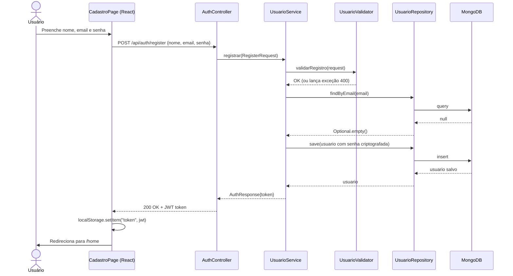

---

### RF-02 — Autenticar Usuário (Login)

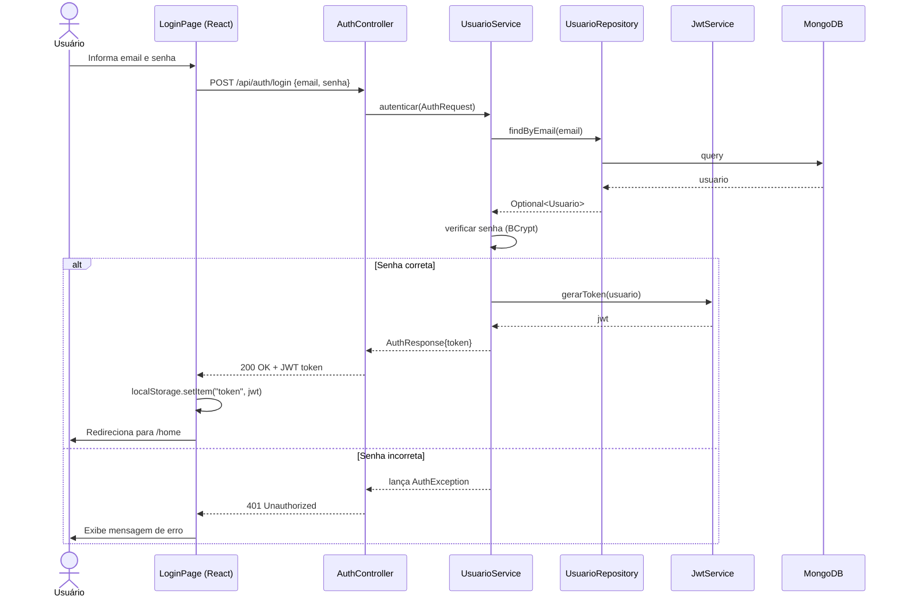

---

### RF-03 — Cadastrar Livro

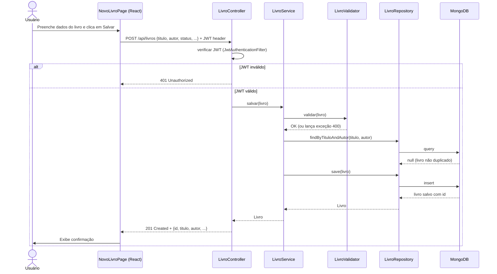

---

### RF-04 — Listar Livros

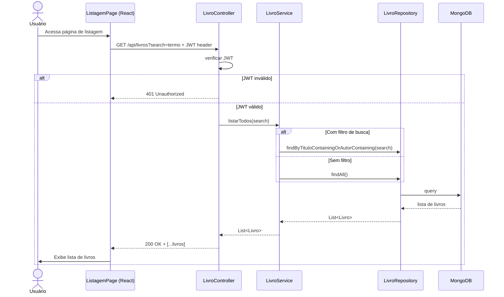

---

### RF-05 — Buscar Livro por ID

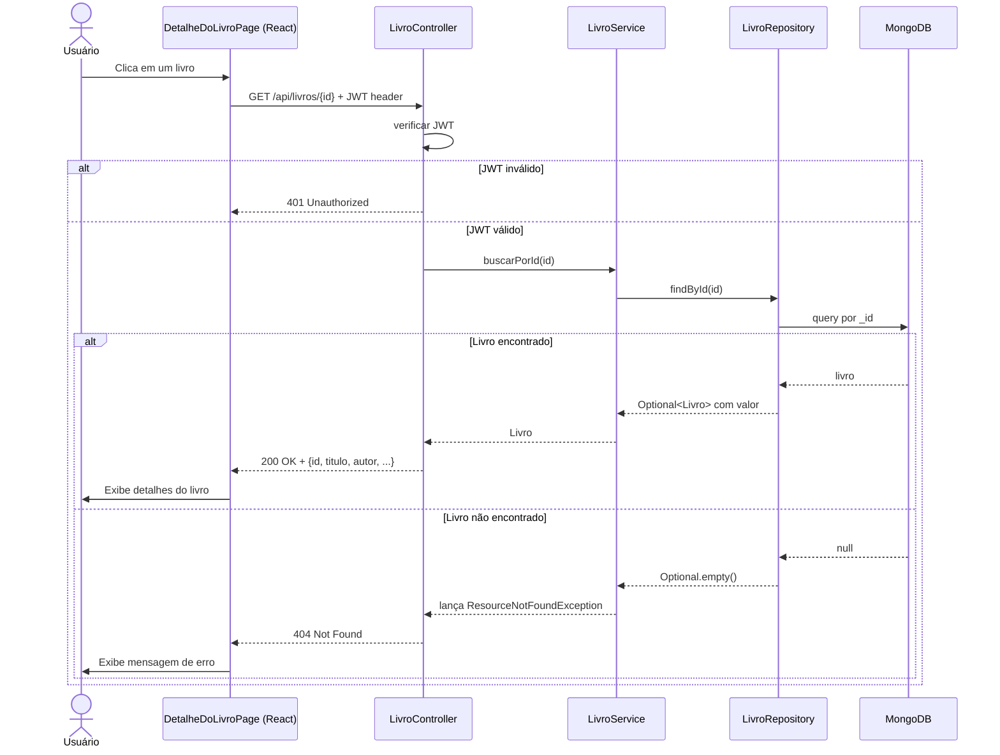

---

### RF-06 — Atualizar Livro

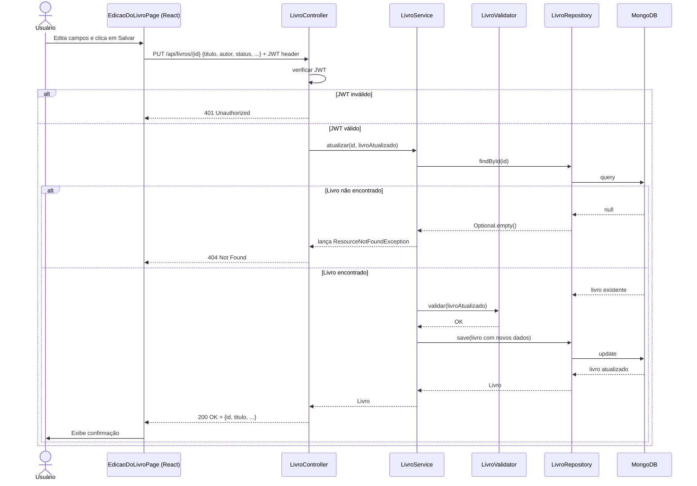

---

### RF-07 — Excluir Livro

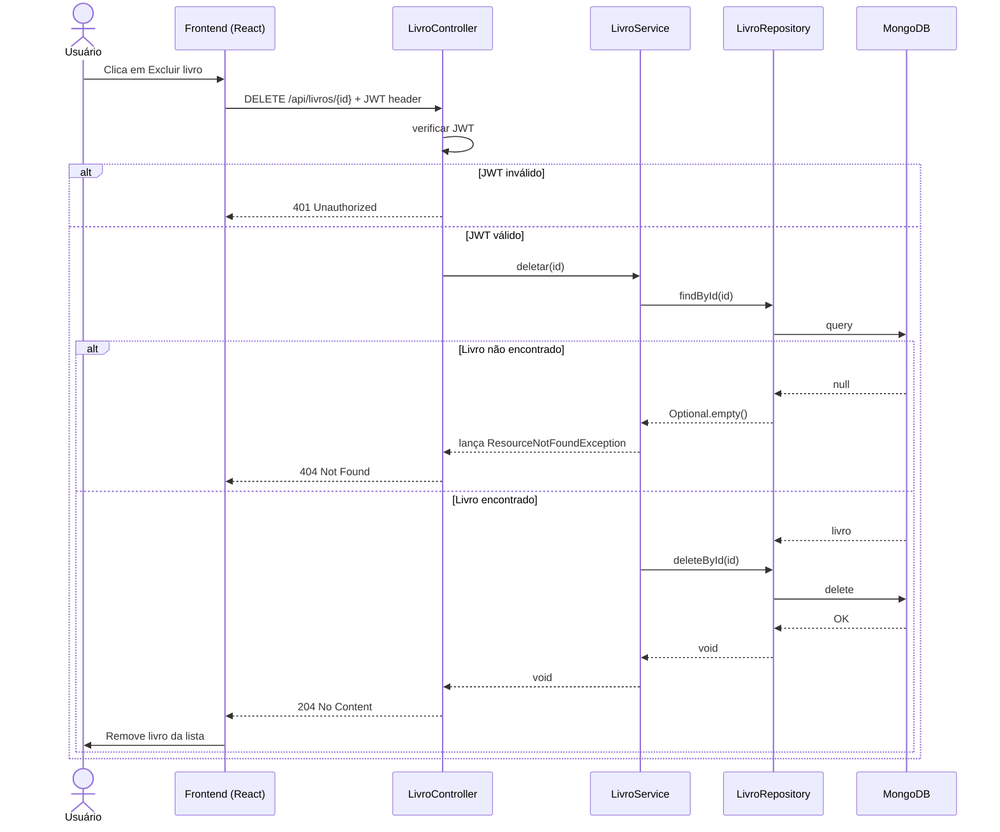

---

### RF-08 — Gerenciar Sessão (Usuário Autenticado)

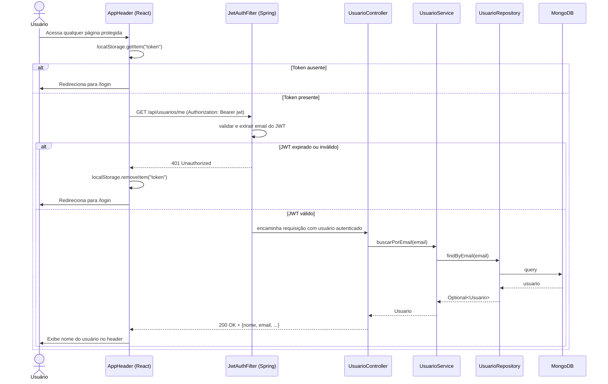

---

### RF-09 — Consultar CEP via API Externa (VCR / WireMock)

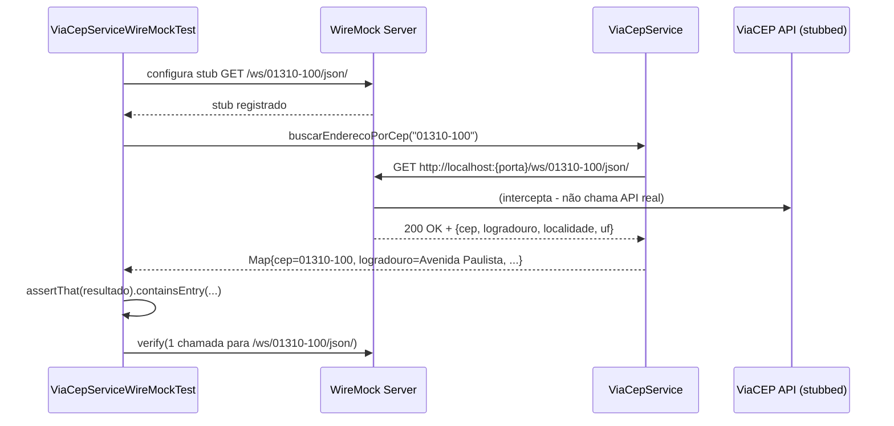

---

### RF-13 — Personalizar Perfil

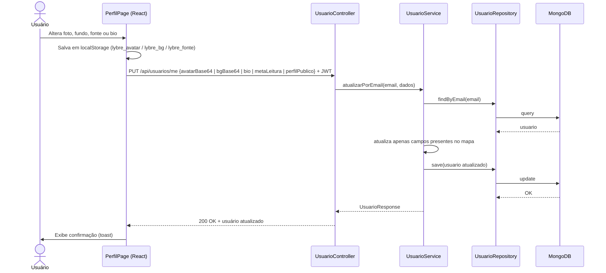

---

### RF-14 — Visualizar Perfil Público

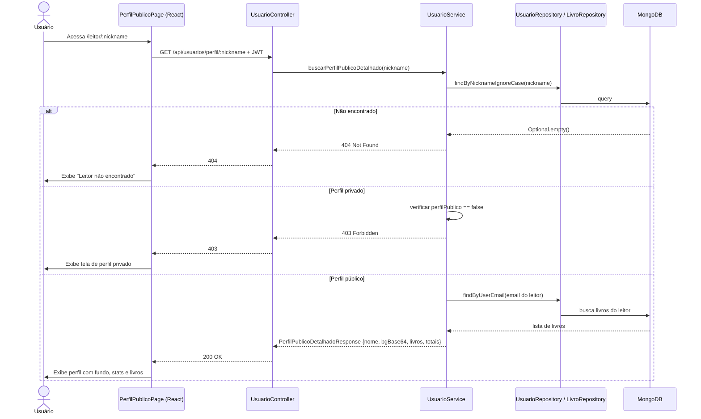

---

### RF-15 — Adicionar Perfil de Leitor

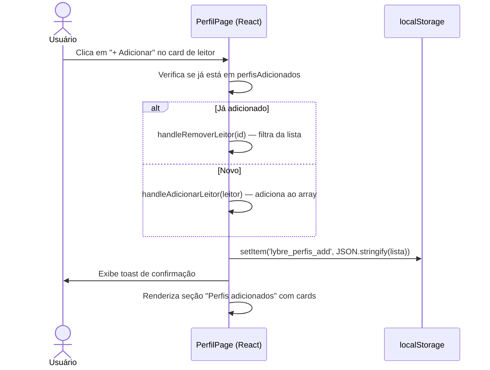

---

### RF-16 — Adicionar Livro de Outro Leitor

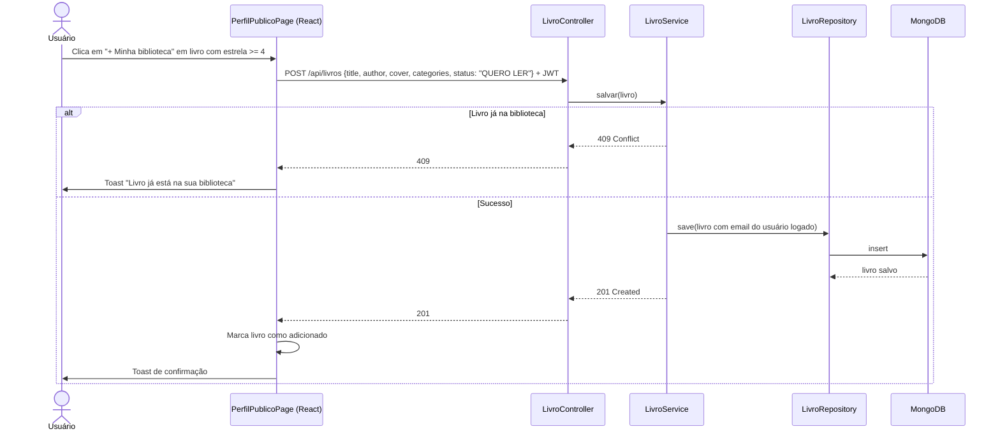

---

## Estratégia de Testes

| Tipo | Arquivo | Ferramenta | Descrição |
|---|---|---|---|
| Unitário parametrizado | `LivroValidatorParamTest.java` | JUnit 5 `@ParameterizedTest` | Valida regras de negócio do `LivroValidator` com 50+ cenários (`@CsvSource`, `@ValueSource`, `@MethodSource`, `@NullAndEmptySource`) |
| Integração | `LivroServiceIntegrationTest.java` | Testcontainers + MongoDB real | Testa `LivroRepository` com banco real e efêmero |
| E2E / Caixa Preta | `AuthE2ETest.java` | Testcontainers + RestTemplate | Fluxo completo de registro e login via HTTP |
| E2E / Caixa Preta | `LivroE2ETest.java` | Testcontainers + RestTemplate | CRUD completo de livros via HTTP com JWT |
| VCR / WireMock | `ViaCepServiceWireMockTest.java` | WireMock 3.5.2 | Testa integração com API externa (ViaCEP) sem dependência da internet |
| E2E / Caixa Preta | `AvaliacaoE2ETest.java` | Testcontainers + RestTemplate | 20 cenários: criar/atualizar/excluir avaliação, listar, calcular médias, outros leitores, validação de rating 1-5, JWT |
| E2E / Caixa Preta | `UsuarioE2ETest.java` | Testcontainers + RestTemplate | 14 cenários: GET /me, PUT /me (bio, metaLeitura, perfilPublico, bgBase64, nickname), perfil público (200/403/404/estatísticas), listar leitores, pesquisar por nome e @nickname |

> ⚠️ **Nenhum Mock (`@Mock`, `@MockBean`, `Mockito.mock()`) foi utilizado.** Todos os testes de persistência usam MongoDB real via Testcontainers, conforme exigido pelo professor.

---

## Cobertura de Código (JaCoCo)

- **Cobertura alcançada: 88.3%** no SonarCloud (mínimo exigido: 80%) — check JaCoCo aprovado no CI
- Relatório gerado com: `./mvnw clean verify` (ou baixar artefato `test-reports` do GitHub Actions)
- Abrir: `backend/target/site/jacoco/index.html`

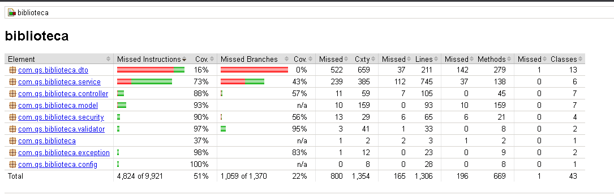

---

## Evidências de Qualidade

| Item | Evidência | Status |
|---|---|---|
| Cobertura JaCoCo ≥ 80% | `img/Jacoco.png` — 88.3% no SonarCloud, check aprovado no CI | ✅ |
| SonarCloud — Quality Gate | Passed — 0 issues, 0 hotspots, Security A, Reliability A, Maintainability A | ✅ |
| SonarCloud — Cobertura | 88.3% | ✅ |
| GitHub Actions (CI) | Pipeline #45 verde — backend ✅ frontend ✅ sonarcloud ✅ — 2m 35s | ✅ |
| Testes passando (CI) | Artefato `test-reports` (491 KB) disponível no GitHub Actions | ✅ |
| Link SonarCloud | https://sonarcloud.io/project/overview?id=AnaPaula2024_biblioteca | ✅ |
| Link GitHub Actions | https://github.com/AnaPaula2024/biblioteca/actions | ✅ |

### GitHub Actions — Pipeline Verde

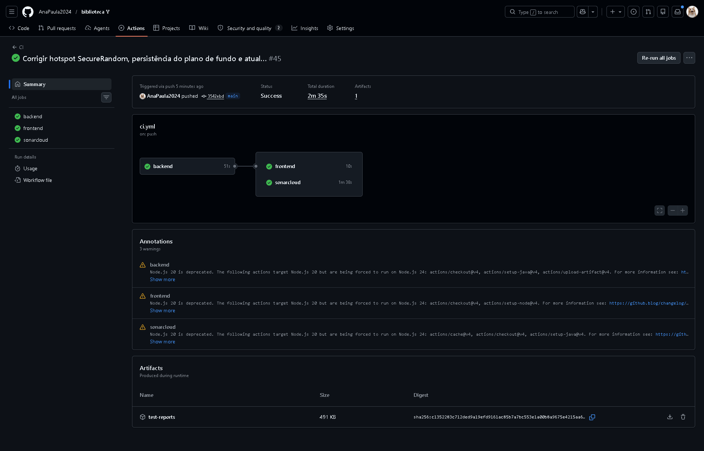

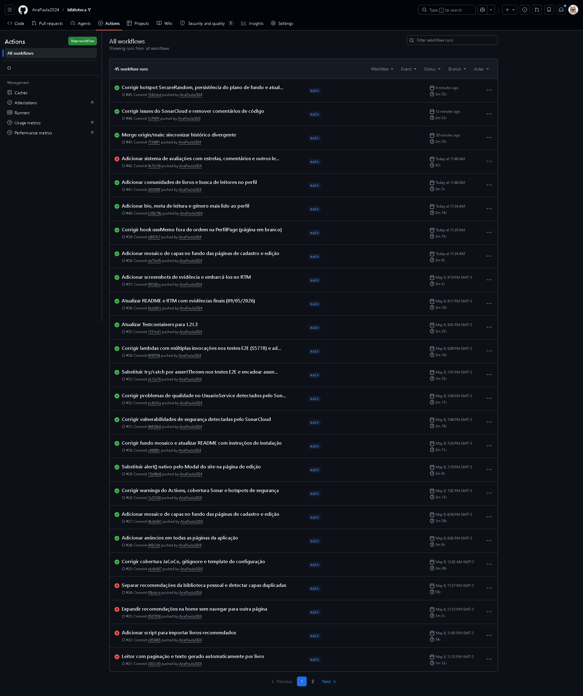

### SonarCloud — Quality Gate

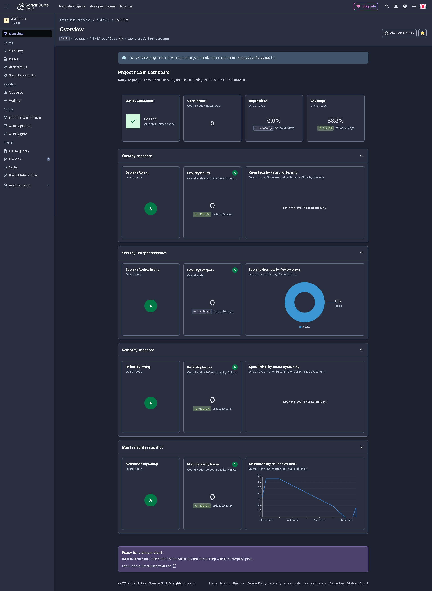

---

*Revisão final: 10/05/2026 — Pipeline #45, cobertura 88.3%, 0 Security Hotspots*
